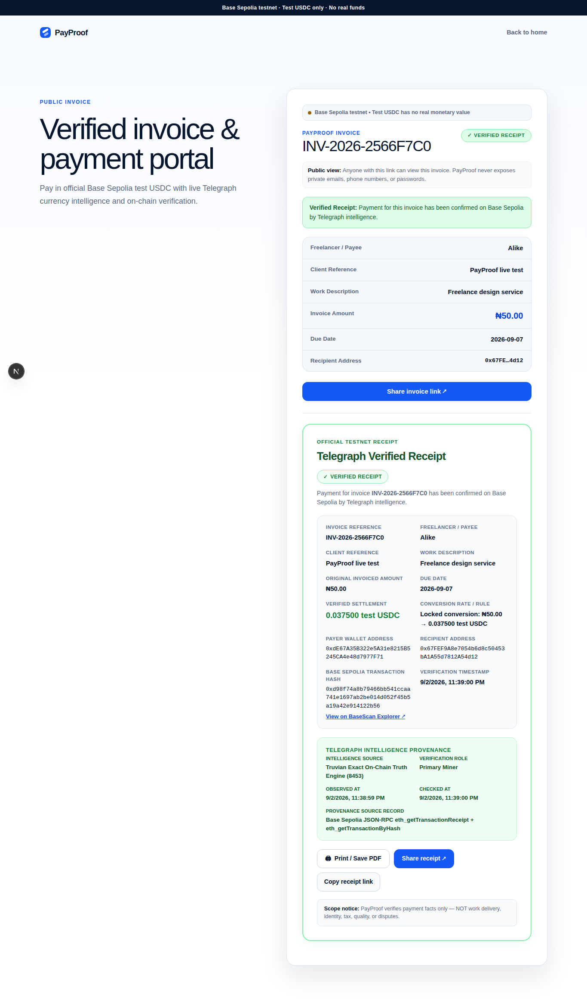
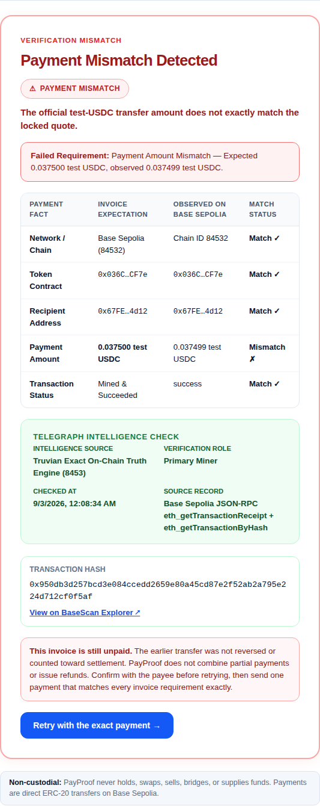

# PayProof

[](https://github.com/Alike001/payproof/actions/workflows/ci.yml)


**Invoice in a familiar currency. Get paid directly in test USDC. Prove the
payment without trusting a screenshot.**

PayProof is a testnet invoice product built for Telegraph Hackathon Season I,
Track 3. A freelancer creates an invoice in NGN, USD, EUR, or GBP, and shares one
public link. Telegraph intelligence supplies the currency conversion and checks
the resulting Base Sepolia transaction. When every payment fact matches, that
same link becomes a permanent verified receipt.

> **Testnet only:** PayProof uses Base Sepolia and official Circle test USDC.
> Test tokens have no real monetary value.

**Live testnet application:** [telegraph-track3-bravo-k7m4.vercel.app](https://telegraph-track3-bravo-k7m4.vercel.app/)

## See the product

These are real local product states backed by real Base Sepolia transactions and
paid Telegraph Miner calls—not fabricated demo responses.

### Exact payment becomes a verified receipt

<p align="center">
  
</p>

### Wrong amount fails closed

<p align="center">
  
</p>

The mismatch example expected `0.037500` test USDC but received `0.037499`.
PayProof identified the exact failed requirement, issued no receipt, and kept the
invoice open for a correct retry.

## The 30-second explanation

Think of PayProof as an invoice and an independent payment witness in one link:

1. A freelancer writes the invoice in a currency both people understand.
2. Telegraph provides a current conversion into test USDC.
3. The client pays the freelancer directly on Base Sepolia.
4. Telegraph reads the transaction, and PayProof checks the chain, token,
   recipient, amount, transaction hash, and successful status.
5. Only an exact match changes the invoice into a verified receipt.

PayProof never holds the payment and never treats a wallet response, transaction
hash, RPC response, or screenshot alone as proof.

## Why Telegraph matters

Without Telegraph, PayProof would have to trust one centralized data provider or
show users raw blockchain details and ask them to interpret those details.
Telegraph gives the application normalized intelligence with Miner provenance.
PayProof then applies deterministic local rules before making a decision.

PayProof currently consumes two supported intents:

| Intent | Product decision | Configured Miners |
| --- | --- | --- |
| `CURRENCY_EXCHANGE` | How much test USDC is required for an NGN, EUR, or GBP invoice | FX Rate Mirror `20260827` with Preflight `20260828` as eligible backup |
| `ONCHAIN_TX_LOOKUP` | Whether the saved Base Sepolia transaction exactly paid this invoice | Truvian `8453` with INTERLOCK `9007` as eligible backup |

Two intents are a deliberate product choice, not a missing requirement. The
hackathon encourages useful multi-intent integrations, but it does not require
every application to use three intents. PayProof keeps both intents central to
the decision: one fixes the amount to pay, and the other determines whether a
receipt may be issued.

The primary Miner is attempted first. A backup is used only when the primary is
unavailable or returns invalid evidence—never to shop for a more convenient
answer. Direct Miner/x402 calls prove application integration; PayProof does not
claim that they count as Miner leaderboard volume.

## What works today

- Wallet connection and free Ethereum wallet sign-in
- Creator-protected invoice creation and history
- NGN, USD, EUR, and GBP invoices with exact decimal handling
- Public, unguessable invoice links with copy/native sharing
- Live paid Telegraph FX quotes with 15-minute expiry and provenance
- Direct official test-USDC transfers on Base Sepolia
- Immediate transaction-hash persistence after broadcast
- Paid Telegraph transaction verification with strict normalized adapters
- Exact success and mismatch decisions using integer token units
- Permanent, printable, shareable verified receipts
- Cancellation, duplication, overdue, retry, unavailable, and mismatch states
- Privacy-safe, deduplicated usage evidence with internal-test separation
- A free `/api/health` readiness endpoint and redacted operational logs

## Architecture

| Stage | What happens | Trust boundary |
| --- | --- | --- |
| Invoice | The freelancer creates a local-currency invoice with a wallet-locked recipient. | Supabase ownership rules protect creator-only actions. |
| Quote | Telegraph currency intelligence returns evidence used to lock the exact test-USDC amount for 15 minutes. | Miner output is normalized and validated on the server. |
| Payment | The payer transfers official test USDC directly to the freelancer on Base Sepolia. | PayProof never holds or redirects the funds. |
| Verification | Telegraph on-chain intelligence reports the mined transfer facts. | The server independently checks chain, token, recipient, amount, hash, and success status. |
| Decision | An exact match produces a permanent receipt; any mismatch names the failed requirement and produces no receipt. | A wallet response, RPC result, hash, or screenshot alone can never verify an invoice. |

The browser can request a transfer, but only server-side normalized Telegraph
evidence plus exact local checks can finalize an invoice. Telegraph payment keys,
Supabase service credentials, raw x402 headers, and analytics secrets remain in
server-only modules.

## Technology

- Next.js 16 App Router, React 19, and strict TypeScript
- RainbowKit, Wagmi, and Viem for Base Sepolia wallet interaction
- Supabase Auth and Postgres with row-level security
- Telegraph direct-ask/x402 integration with strict Miner adapters
- Decimal.js and integer minor/base units for all money calculations
- Vitest and Playwright for unit, integration, database, and browser coverage
- Vercel-ready Node.js deployment

## Local development

### Requirements

- Node.js 24
- npm 11 or newer
- Docker-compatible container runtime
- Supabase CLI access through the locked project dependency
- A disposable Base Sepolia wallet for paid Telegraph development calls

### Setup

```bash
git clone https://github.com/Alike001/payproof.git
cd payproof
cp .env.example .env.local
npm ci
npm run supabase:start
npm run db:reset
npm run dev
```

Open `http://localhost:3000`.

`npm run db:reset` is intended only for a fresh or disposable local Supabase
database because it rebuilds local data. Do not use it against evidence you need
to preserve.

Fill every value documented in [`.env.example`](.env.example). Important rules:

- Keep private keys and service credentials out of `NEXT_PUBLIC_*` variables.
- Use a new, disposable testnet-only wallet for Telegraph x402 payments.
- Add `http://localhost:3000` to the Supabase Web3 origin allowlist.
- Put team-controlled creator and payer addresses in
  `INTERNAL_TEST_WALLETS`, separated by commas, so internal testing is not
  reported as outside adoption.
- Never commit `.env.local`.

## Verification

Run the complete local quality gate before opening or merging a pull request:

```bash
npm run check
```

The command runs warning-free lint, strict type checking, the Vitest suite, and
an optimized production build. Additional checks used during hardening include:

```bash
npm run test:coverage
npx playwright test
npx supabase db lint --local --level error
```

Paid Telegraph live tests are opt-in so an ordinary test run can never spend
test USDC unexpectedly. See [`package.json`](package.json) and the files under
[`tests/live`](tests/live) for the explicit live-test commands and required
environment flags.

## Real verification evidence

Exact-payment proof:

- [Base Sepolia payment transaction](https://sepolia.basescan.org/tx/0xd98f74a8b79466bb541ccaa741e1697ab2be014d052f45b5a19a42e914122b56)
- Required and observed amount: `37,500` USDC base units
- Telegraph transaction Miner: Truvian `8453`, primary
- [x402 settlement transaction](https://sepolia.basescan.org/tx/0xdd77fe70a7879d0221b4e899fd60407b63a1cf1f7a5d8c71413e3c33e0b922ab)

Wrong-amount rejection proof:

- [Base Sepolia mismatch transaction](https://sepolia.basescan.org/tx/0x950db3d257bcd3e084ccedd2659e80a45cd87e2f52ab2a795e224d712cf0f5af)
- Required: `37,500`; observed: `37,499` USDC base units
- Result: terminal `WRONG_AMOUNT` for that payment attempt, with no receipt
- [x402 settlement transaction](https://sepolia.basescan.org/tx/0x58ad4aa33120fb411decc680a03b1b52e1f2d71fcb825c96be18863d71b07660)

Detailed build decisions and reproducible evidence are recorded in
[`docs/payproof-build/build-notes.md`](docs/payproof-build/build-notes.md).

## Security and privacy boundaries

- Payments travel directly from payer to freelancer; PayProof is non-custodial.
- Only Base Sepolia chain `84532` and official Circle test USDC are accepted.
- Money is stored and compared as decimal strings and integer units, never native
  JavaScript floating-point values.
- Creator ownership comes from a verified Web3 session, not a submitted address.
- Public receipts intentionally expose relevant on-chain evidence but never
  emails, phone numbers, passwords, private keys, or analytics identities.
- Usage identities are one-way hashes; repeated refreshes are deduplicated.
- Paid calls have origin, network, asset, per-call, daily-budget, cooldown, and
  idempotency protections.
- Production source contains no success mock, demo bypass, or fabricated Miner
  fallback.

## Deliberate MVP limits

The seven-day product intentionally excludes mainnet payments, other chains or
tokens, automatic email/WhatsApp delivery, recurring invoices, partial payments,
escrow, disputes, tax calculation, teams, and currencies beyond NGN, USD, EUR,
and GBP.

PayProof verifies payment facts. It does not verify work delivery, identity,
quality, tax obligations, or disputes, and it cannot reverse or refund a direct
wallet transfer.

## Deployment status and future improvements

PayProof is publicly deployed as a Base Sepolia MVP at
[telegraph-track3-bravo-k7m4.vercel.app](https://telegraph-track3-bravo-k7m4.vercel.app/). Production smoke
testing and genuine external tester journeys are in progress; local developer
activity remains separated from outside adoption evidence.

After the hackathon MVP is deployed and stable, useful improvements include:

- evaluating `WALLET_BALANCE_CHECK` or `GAS_PRICE` as an optional third intent
  for payer readiness, but only if live Miner quality makes the signal useful;
- comparing Telegraph auto-routing with the current explicit primary/backup
  strategy;
- adding notification, recurring/partial-payment, and additional-currency
  workflows after their security and product boundaries are designed; and
- assessing mainnet support only after a separate security, legal, and economic
  review.

These are roadmap ideas, not claims about the current product.

## Project documentation

- [Accepted scope](docs/payproof-build/scope.md)
- [Product requirements](docs/payproof-build/prd.md)
- [Technical specification](docs/payproof-build/spec.md)
- [Ordered build checklist](docs/payproof-build/checklist.md)
- [Telegraph research and live compatibility](context)
- [Comparable open-source project research](research)

## Team

PayProof is built by **Bravo**, a two-developer team. Ali
([@Alike001](https://github.com/Alike001)) leads architecture,
security-sensitive integrations, database contracts, Telegraph/x402 work, and
pull-request review. The teammate owns assigned interface, accessibility,
responsive, browser-testing, and tester-handoff slices through reviewed feature
branches.

Built for [Telegraph Protocol](https://telegraphprotocol.com/)
[Hackathon Season I](https://hackathon.telegraphprotocol.com/), Application
Track, on Base Sepolia.
